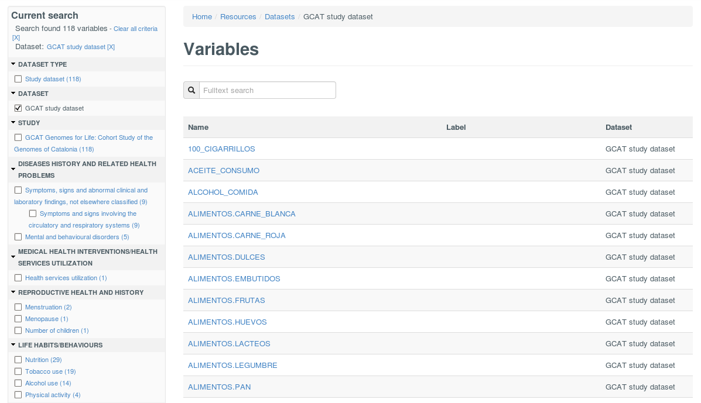
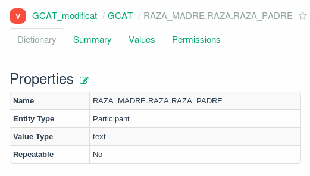

# What is BioSHaRE?

- **Bio**bank **S**tandardisation and **Ha**rmonisation for **R**esearch **E**xcellence in the European Union.
- The mission of BioSHaRE is to **develop harmonized measures and standardized computing infrastructures** enabling the effective **pooling of data** and key measures of life-style, social circumstances and environment, as well as critical sub-components of the phenotypes associated with common complex diseases.

[@Doiron2013]

# What is Mica?

- Mica is a software application developed to create web portals for individual epidemiological studies or for study consortia.
- It includes
  - standardized study catalogue
  - data dictionary browsers
  - online data access request forms
  - communication tools

# Standarized study catalogue

- Study design
- Populations
- Data collection events
- Questionnaires

# Data dictionary

- Study dataset

# Other information

- Online data access request forms
- Communication tools

# Harmonization

- DataSHaPER
- Opal
- Mica

# GCAT

- Data dictionary
  - Definition
  - Classification

# Date inventory

^[http://bit.ly/1OyIoEI]
