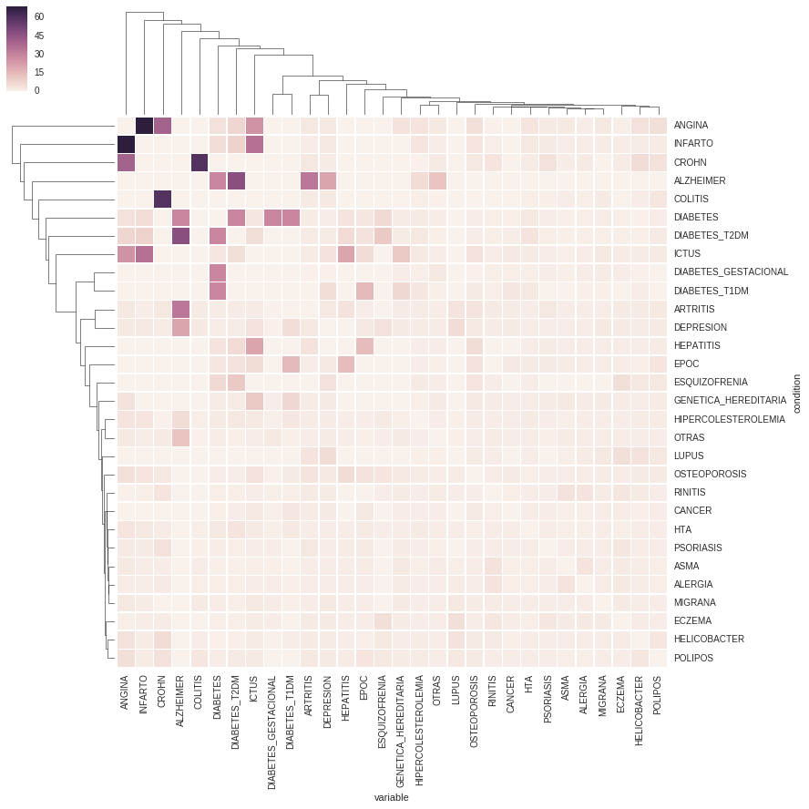
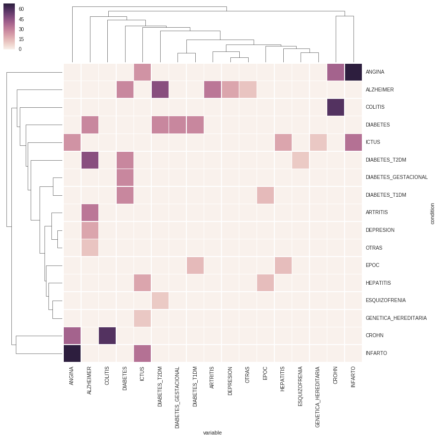
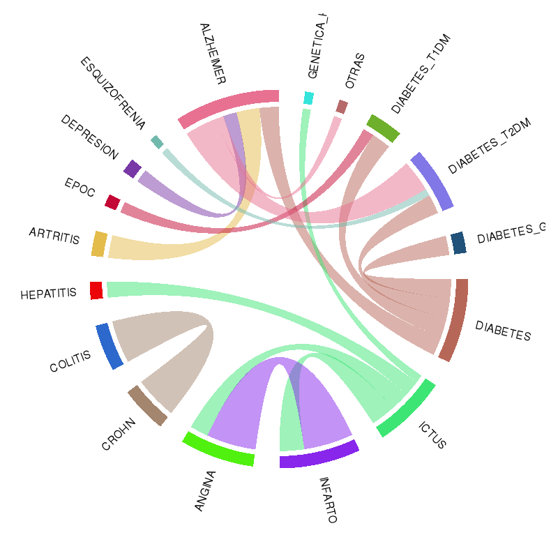
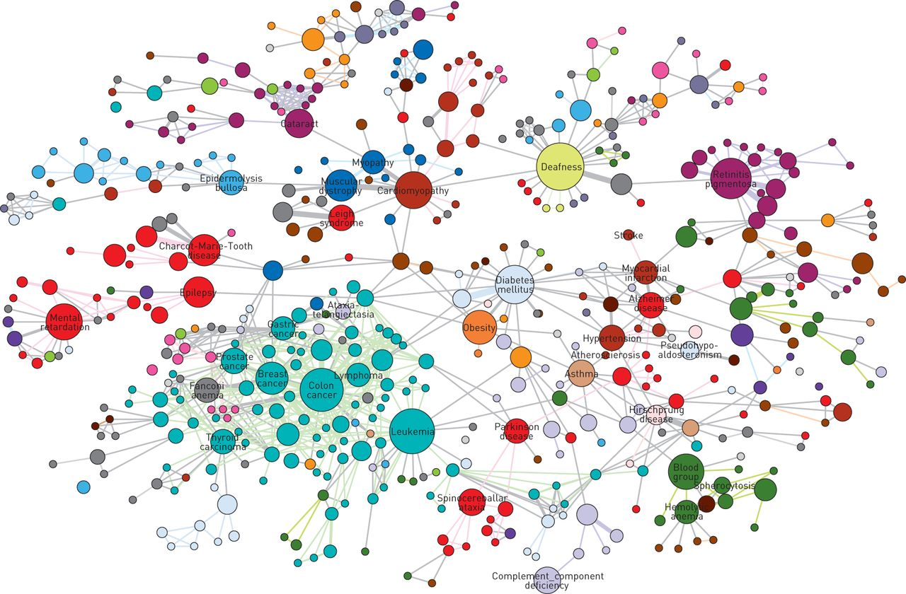
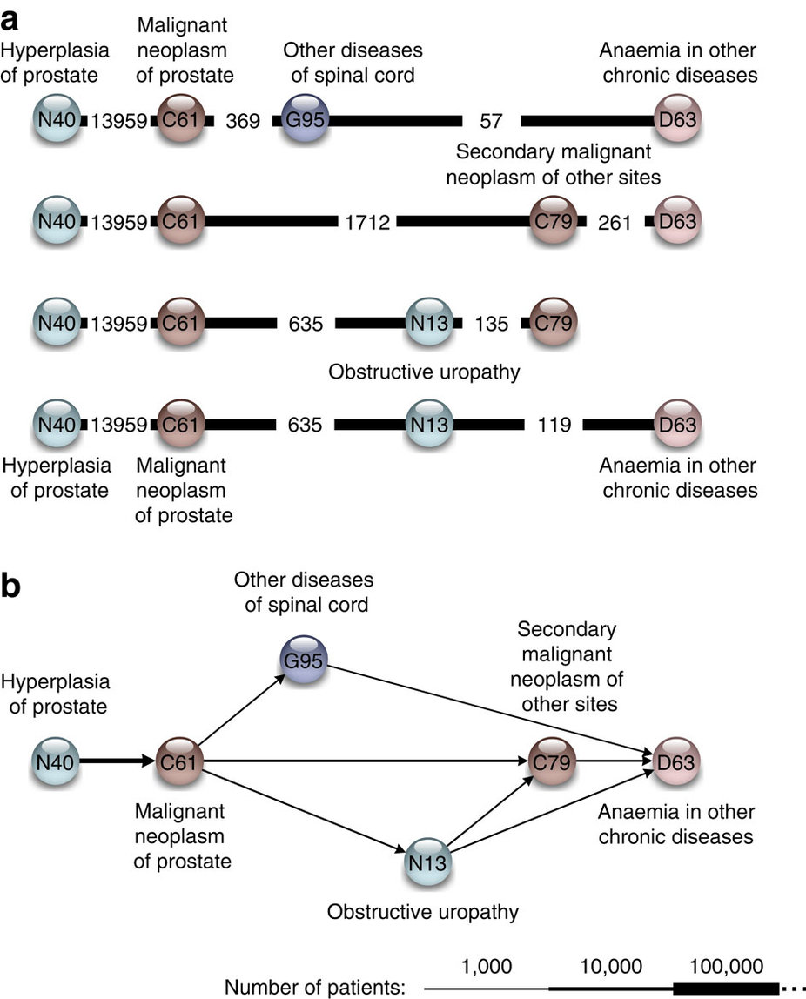
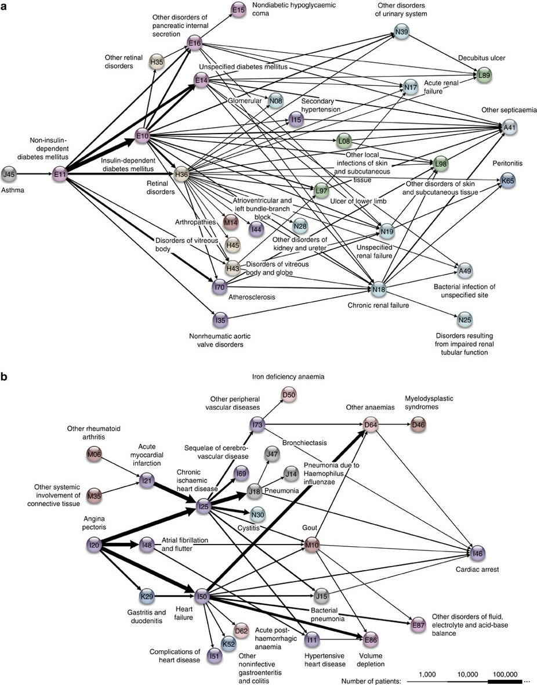

# Population-based disease associations

- Diseases have multiple causes and are related through several dimensions
- Diseases can be linked based on comorbidities associations
- Calculate pairwise comorbidity correlations

# Distance between two diseases: Relative Risk

$$RR_{ij} = \frac{C_{ij}N}{P_iP_j}$$

- $C_{ij}$ is the number of the patients affected by both diseases, $N$ is the total number of patients and $P_i$ and $P_j$ are the prevalences of diseases $i$ and $j$
- $RR_{ij}$>1 comorbidity is larger than expected by chance
- $RR$ **overestimates** relationships involving **rare diseases** and **underestimates** comorbidity between **highly prevalent** ones
- Most widespread use in the medical literature (@Hidalgo2009)

# Distance between two diseases: $\phi$-correlation

$$\phi_{ij} = \frac{C_{ij}N-P_iP_j}{\sqrt{P_iP_j(N-P_i)(N-P_j)}}$$

- Pearson's correlation for binary variables
- **Accurately discriminates** comorbidities betweens pairs of diseases of **similar prevalence**
- **Underestimates** the comorbidity between rare and common diseases

# GCAT comorbidities

# GCAT comorbidities

# GCAT comorbidities

# Human disease network

# Temporal comorbidity analysis

Temporal disease trajectories condensed from population-wide registry data covering 6.2 million patients (@Jensen2014)

- EHR as medical event sequences
- Temporal disease progression
- Comprehensive set of disease trajectories
- D1→D2 pairs of diagnosis
- Relative Risk (RR)>1
- Directional pairs were then combined into longer trajectories consisting of three or more diagnoses
- 1171 significant trajectories of four diagnosis that forms 15 major clusters

# Temporal comorbidity analysis

# Temporal comorbidity analysis

# References
