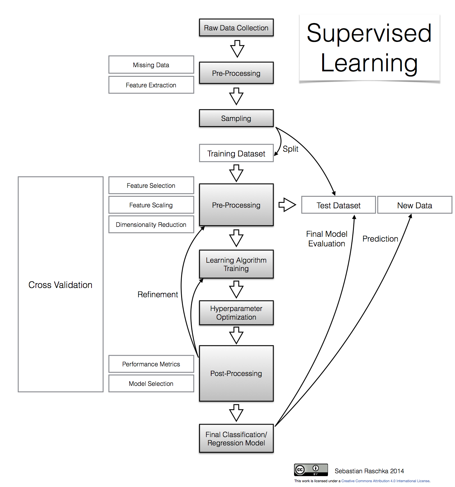
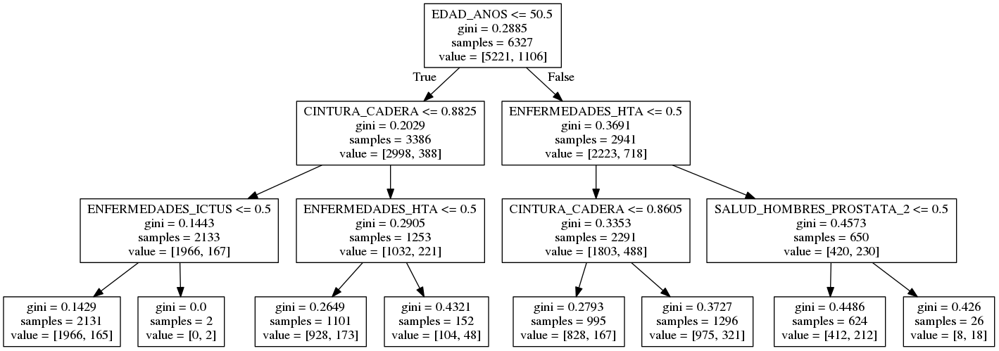

## Qüestionari epidemiològic

\begin{columns}
  \begin{column}{0.5\textwidth}
    \begin{itemize}  
    \item Onyx 
    \item Opal 
    \item 4000+ variables del qüestionari
    \item 3000+ variables filtrades
    \item Exportació diària a P:/gcat-cohort/output/export (R + cron)
    \end{itemize}
  \end{column}
  \begin{column}{0.5\textwidth}
      \begin{center}
       \includegraphics[scale=0.4]{images/export.png}
       \end{center}
  \end{column}
\end{columns}
    
## Selecció i agrupació de variables

\begin{columns}
  \begin{column}{0.5\textwidth}
  \begin{itemize}  
    \item Hàbits alimentaris 
    \item Dieta mediterrània (PREDIMED)
    \item Activitat física
    \item Tabac
    \item Alcohol
    \item Cribatges
    \item ...
    \end{itemize}
  \end{column}
  \begin{column}{0.5\textwidth}
     Magma Javascript API
    \begin{figure}[h]       
        \mbox{\includegraphics[height=1.6in]{images/"cribado js".png}}
        \mbox{\includegraphics[height=1in]{images/vistes.png}}
    \end{figure}
  \end{column}
\end{columns}

## Eines de preprocés de dades

## Preprocessament de dades
### Mesures antropomètriques

- Alçada
- Pes
- Cintura
- Maluc
- Tensió arterial
- Pols
- BMI
- WHR

## Preprocessament de dades
### Pes

\includegraphics[width=1\linewidth]{images/"Heigt Weight measures".png}

## Preprocessament de dades
### Errors sistemàtics

\includegraphics[width=1\linewidth]{images/"Heigt Weight systematic errors".png}

## Preprocessament de dades
### Errors sistemàtics

\includegraphics[width=1\linewidth]{images/"Heigt Weight systematic errors corrected".png}

## Preprocessament de dades
### Outliers

\includegraphics[width=1\linewidth]{images/"Heigt Weight systematic outliers".png}

## Preprocessament de dades
### Coherència en les dades

- Gènere
- Edat i data de naixement
- Localitzacions

## Preprocessament de dades
### Medicació

\begin{figure}[h]       
    \mbox{\includegraphics[height=1.2in]{images/"Medications HTA coded".png}}   
    \mbox{\includegraphics[height=1.2in]{images/"Medications HTA".png}}
\end{figure}

## Preprocessament de dades
### Medicació

\begin{figure}[h]       
    \mbox{\includegraphics[height=1.2in]{images/"Medications HTA inferred".png}}
\end{figure}

Falta comprovar coherència entre la condició i la medicació reportada

## Codificació de variables

Creació de dos datasets per utilitzar segons l'algorisme de machine learning

- Categoritzat
- Binari: Dummy Variables (one-hot encoding)

\begin{figure}[h]       
    \mbox{\includegraphics[height=1.2in]{images/"etnia categoria".png}}
    \mbox{\includegraphics[height=1.2in]{images/etnia.png}}
\end{figure}

## Missings

- Deixar-los com estan
- Eliminar de l'anàlisi participants amb missings en la variable d'interès
- Imputar variables
  - Mitjana, mediana de la variable
  - Inferir variable segons participants més 'semblants'

## Problema exemple
### Predictor hipercolesterolèmia

## Selecció del model

## Arbre de decisió resultat

## Avaluació del model

\begin{figure}[h]       
    \mbox{\includegraphics[height=1.6in]{images/"ROC hypercholesterolemia".png}}
    \mbox{\includegraphics[height=1.6in]{images/confusion.png}}
\end{figure}
