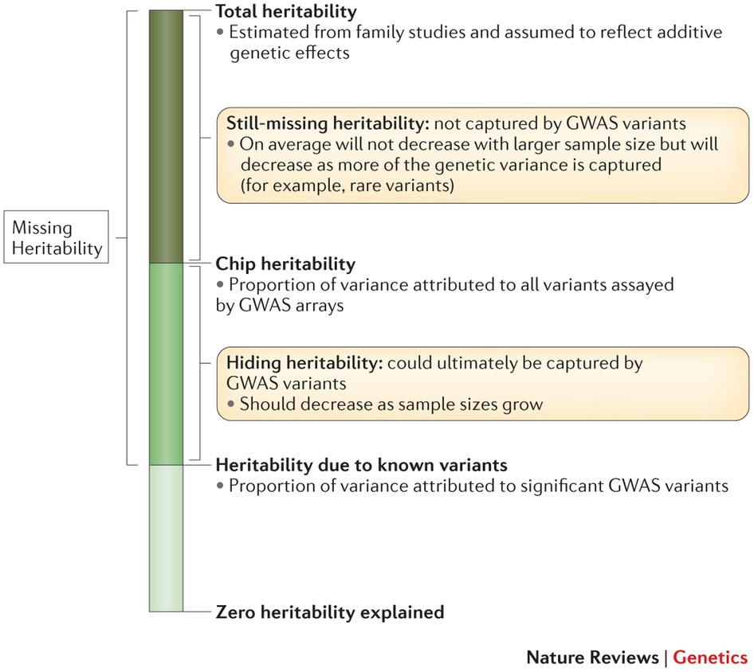
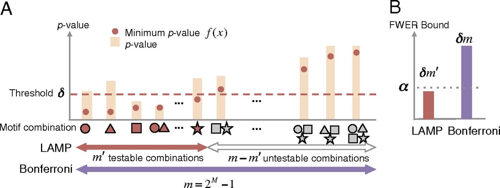

## Missing heritability problem on GWAS



## Limitless arity multi-testing procedure (LAMP)

Significant pattern mining techniques can help to find high-order interactions on GWAS data (and other biological data)

\pause

### Outline

The complexity of combinatorial variant discovery

\pause

How does LAMP approaches a solution

\pause

Results on a lung cancer dataset


## Finding combinations of features
### Computational problem

Exploring all combinations is computationally prohibitive

\pause

$M^2$ second order possible interactions

\pause

$2^M$ limitless order interactions

\pause

### Statistical problem

Discovered combinations are statistically unlikely due to multiple testing correction

\pause

For $M$ binary variables, Bonferroni correction sets significance below $\frac{\alpha}{2^M}$


## Finding combinations of features
### Machine learning approaches

Random Forests, Support Vector Machines, Multifactor Dimensionality Reduction

\pause

Variable rankings

\pause

Too many false positives

\pause

Very costly to further explore hypothesis


## Limitless arity multi-testing procedure (LAMP)

11$S=\{SNP_1, SNP_2,...,SNP_n\}$, n is the arity of the combination

\pause

### Fisher's exact test

Not all combinations are frequent enough to become significant in any case/control setting

\pause

||Case|Control|Total|
|--------------|-------:|---:|---:|
|Has $S$|||13|
|Hasn't $S$|||357|
|total|184|186|370|


## Limitless arity multi-testing procedure (LAMP)

$S=\{SNP_1, SNP_2,...,SNP_n\}$, n is the arity of the combination

### Fisher's exact test

Not all combinations are frequent enough to become significant in any case/control setting

||Case|Control|Total|
|--------------|-------:|---:|---:|
|Has $S$|13|0|13|
|Hasn't $S$|171|186|357|
|total|184|186|370|

\pause

raw p-value = $9.1*10^{-5}$

\pause

FWER threshold $\delta=\alpha/1000$ = 0.05/1000 = $5*10^{-5}$

## Limitless arity multi-testing procedure (LAMP)

Multiple testing procedure for listing ALL statistically significant high order interactions

\pause

Upper bound of Family Wise Error Ratio (FWER)



[Terada et al. 2013]

## LAMPLINK

LAMPLINK is implemented as additional features to PLINK

\pause

Model dominant/recessive for the risk class for the minor allele

\pause

### Algorithm

Find all significant combinations

\pause

Remove combinations with SNPs in linkage disequilibrium ($r^2 < threshold$)

## LAMPLINK
### Progression of non-small cell lung cancer (NSCLC) GWAS data


|||
|--|--|
|GWAS threshold | p-value < $10^{-4}$ |
|SNPs | 695 |
|Individuals | 178 |
|Statistical test | Fisher's exact test |
|Adjusted significance level | $5.8*10^{-9}$ |
|Correction factor | 8619336 |
|Significant combinations | 5019 |
|$r^2$ for LD| 0.2 |
|Significant combinations after LD pruning | 145 |
|Significant SNPs | 25 |
|Maximum arity | 7 |

## LAMPLINK
### Progression of non-small cell lung cancer (NSCLC) GWAS data

```{r, echo=FALSE, message=FALSE, warning=FALSE, results='asis'}

library(xtable)
library(dplyr)
library(data.table)
library(stringr)

options(xtable.comment = FALSE)
fread('/imppc/labs/dnalab/xduran/fim/output/lung/assoc_10_4_0.4/assoc.ld.lamp') %>%
  transform(arity=str_count(COMB, ",")+1) %>%
  filter(row_number() %in% 1:20) %>%
  select(Adjusted_P, COMB, arity) %>%
  xtable(auto = TRUE, caption="Top 20 statistically significant variant combinations", tabular.environment="longtable") %>%
  print(scalebox = 0.4, include.rownames=FALSE)
```

## LAMPLINK
### Progression of non-small cell lung cancer (NSCLC) GWAS data

```{r, echo=FALSE, message=FALSE, warning=FALSE, results='asis'}

library(xtable)
library(dplyr)

options(xtable.comment = FALSE)
read.csv2('/imppc/labs/dnalab/xduran/fim/output/lung/assoc_10_4_0.4_pathway/assoc.ld.lamp.comb.csv') %>%
  arrange(desc(COMB)) %>%
  xtable(auto = TRUE, caption="Variants statistically significant in any combination", tabular.environment="longtable") %>%
  print(scalebox = 0.4, include.rownames=FALSE)
```

## LAMPLINK
### Progression of non-small cell lung cancer (NSCLC) GWAS data

NSCLC literature (mostly asian studies)

ELAC2 and HS3ST3A1 on the 50kb window of rs8065393

No significant pathways enriched

## Summary

SNP combined effects may explain a part of the missing heritability but is a computationally and statistically challenging problem

Significant pattern mining can help finding statistically significant combinations of SNPs

The methodology is valid for other types of biomedical data