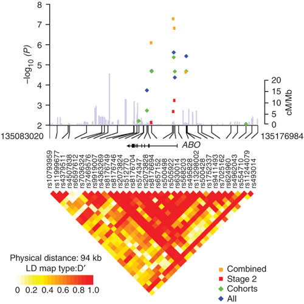
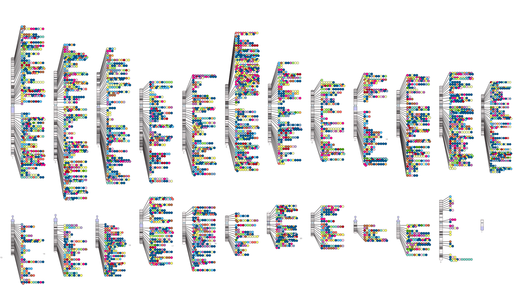
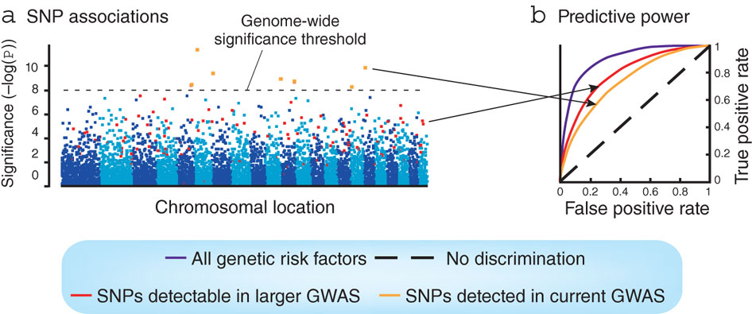
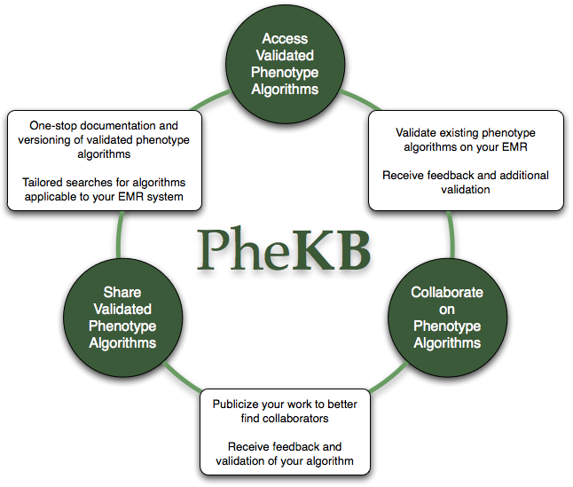
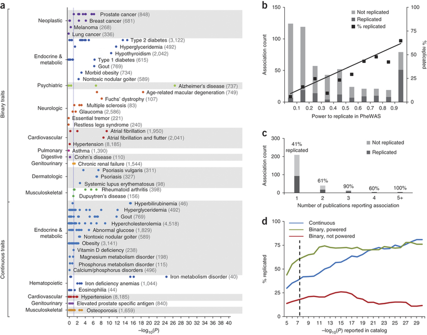
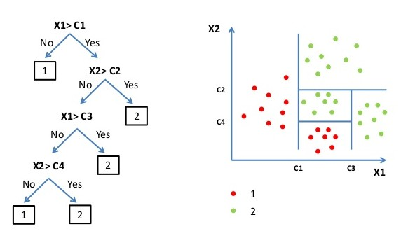

## GCAT genotyping

\begin{columns}
\column{0.5\textwidth}
\begin{center}
\includegraphics[height=3in]{images/gcat-map.png}
\end{center}
\column{0.5\textwidth}
  \includegraphics[scale=0.5]{images/logo-GCAT.png}
  \begin{itemize}
    \item Longitudinal cohort study
    \item More than 10.000 participants
    \item Genotyping first 5.000 participants
    \item 1.2M SNPs
    \item Up to 7 to 10M SNPs after imputation
  \end{itemize}
\end{columns}

## Genome-wide association studies (GWAS)

- Case-control approach
- Identify genetic variants linked to disease risk or a trait
- Test genotype frequency
- Regression modelling (linear, logistic) + covariates (sex, age, ethnicity)
- Multiple comparison, assumption of independence
- Bonferroni correction
- Threshold significance 5x10^-8^

## Genome-wide association studies (GWAS)
### Candidate genes

## Genome-wide association studies (GWAS)
### Success and limitations

- GWAS Catalog

## Genome-wide association studies (GWAS)
### Success and limitations

- Single SNP association studies explain a small part of disease heritability
- The success depends on both biological and statistical reasons

## Phenome-wide association studies (PheWAS)
### An alternative approach

\begin{columns}
\column{0.5\textwidth}
\begin{center}
\includegraphics[height=3in]{images/PheWASShah13.png}
\end{center}
\column{0.5\textwidth}
Scan all the phenotypes of all this patients to find systematic associations between this mutation and all the phenotypes.
\end{columns}

## Phenome-wide association studies (PheWAS)
### Study design

\begin{columns}
\column{0.5\textwidth}
\begin{center}
\includegraphics[height=3in]{images/PheWASViewer.png}
\end{center}
\column{0.5\textwidth}
  \begin{itemize}
    \item Hypothesis-free: only assumes a relationship
    \item Mendelian Randomization
    \item Direction of inference, from exposure to outcome
    \item Systematic examination of variants of special interest
    \item Environmental exposures
    \item Unknown comorbidities
    \item Adjustment for multiple testing (Bonferroni, false discovery rate)
  \end{itemize}
\end{columns}

## Phenome-wide association studies (PheWAS)
### R package

\begin{figure}[h]       
    \mbox{\includegraphics[height=1.2in]{images/phewas_package.png}}   
    \mbox{\includegraphics[height=1.2in]{images/Rplot.png}}
\end{figure}

## Phenome-wide association studies (PheWAS)
### EHR-linked epidemiological study & biobank

\begin{columns}
\column{0.5\textwidth}
\begin{center}
\includegraphics[height=3in]{images/nrg.jpg}
\end{center}
\column{0.5\textwidth}
  \begin{itemize}
    \item Electronic Health Records phenotyping
    \item ICD9-10
    \item EMERGE Network
  \end{itemize}
\end{columns}

## Phenome-wide association studies (PheWAS)
### Electronic phenotyping 

## Phenome-wide association studies (PheWAS)
### PheWAS catalog 

## Phenome-wide association studies (PheWAS)
### Pleiotropy

.png)

- Shared mechanism or biological pathway
- Novel drug targets
- Drug repositioning

## Phenome-wide association studies (PheWAS)
### Phenotypes co-association network

\begin{columns}
\column{0.5\textwidth}
\begin{center}
\includegraphics[height=3in]{images/PheWASViewerNetwork.png}
\end{center}
\column{0.5\textwidth}
  \begin{itemize}
    \item Each node represents a phenotype
    \item The color represents the clinical category of the phenotype
    \item The weight of the link depends on the number of co-association in the different analyses
  \end{itemize}
\end{columns}

## Machine learning valuable alternatives

\begin{columns}
\column{0.5\textwidth}
\begin{center}
\includegraphics[height=1in]{images/Supervised-Learning-Algorithms.png}
\includegraphics[height=1in]{images/Unsupervised-Learning-Algorithms.png}
\end{center}
\column{0.5\textwidth}
  \begin{itemize}
    \item Learn from known data (model and hypothesis generation)
    \item Make predictions about unknown data
  \end{itemize}
\end{columns}

## Decision trees
### Building a tree

## Decision trees
### Problems

\begin{columns}
\column{0.5\textwidth}
\begin{center}
\includegraphics[height=1.5in]{images/overfitting.jpg}
\newline
\includegraphics[height=1.5in]{images/S0tRm.png}
\end{center}
\column{0.5\textwidth}
  \begin{itemize}
    \item Memorizing data: signal and noise
    \item Overfitting
    \item Poor generalization
  \end{itemize}
\end{columns}

## Decision trees
### Bias-variance tradeoff

\begin{columns}
\column{0.5\textwidth}
\begin{center}
\includegraphics[height=3in]{images/bias_variance.png}
\end{center}
\column{0.5\textwidth}
  \begin{itemize}
    \item Decision trees have low bias but high variance
  \end{itemize}
\end{columns}

## Random Forests
### An ensemble of classification trees

\begin{columns}
\column{0.5\textwidth}
\begin{center}
\includegraphics[height=3in]{images/RFBaker15.png}
\end{center}
\column{0.5\textwidth}
  \begin{itemize}
    \item Collection of trees
    \item Non-deterministic using a two-stage randomization procedure
    \item Decorrelate trees
    \item Low variance
  \end{itemize}
\end{columns}

## Random forests
### Algorithm

.jpg)

## Random forests
### Hyperparameters

- Number of trees
- Number of selected variables per node ($\sqrt{M}$)
- Impurity measure (best split)
- Maximum depth of the tree before terminating into a prediction

## Random forests
### Association studies with Random Forests

- Smallest possible set of genes that can still achieve good predictive performance
- Well suited for microarray data
- Can be used when there are many more variables than observations
- Good predictive performance even when most predictive variables are noise
- Incorporates interactions among predictor variables

## Random forests
### Classify new samples

 1.jpg)

## Random forests
### Ranking variables

 2.jpg)

## Random forests
### Manhattan plot

.png)

## Random forests
### Genomic profiling

.png)

## Summary

- Curse of dimensionality
- It will be worse with NGS!
- N << #variables
- Need to new exploratory, hypothesis-free methods

Thanks!
